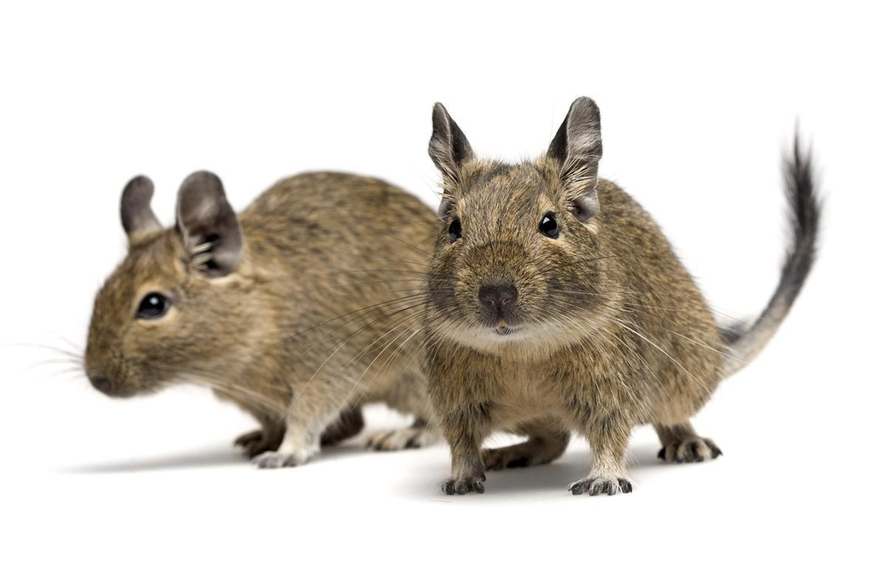
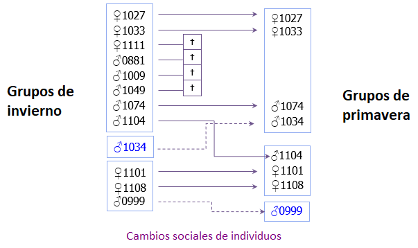

```{r setup, include=FALSE}
knitr::opts_chunk$set(echo = FALSE)
library(tidyverse)
library(kableExtra)
library(formattable)
library(readxl)
library(lme4)
library(MuMIn)
options("kableExtra.html.bsTable" = T)
```

## <span style="color:purple"> _Octodon degus_ & **Cooperación**</span>



## Pregunta biológica

```{r, echo = FALSE, fig.align= "center"}


```

<span style= "color:orchid4">Movimientos sociales entre las dos temporadas medidas... ¿Y espaciales? </span>


## Datos

```{r, warning=FALSE}
data <- read_excel("data.xlsx") 
data$fitness <- as.numeric(as.character(data$fitness))

d <- data %>% group_by(Sex, Year) %>% summarise(Individuos = n()) 
inline <- d %>% spread(key = Sex, value= Individuos) 
explicacion <- d %>% spread(key = Year, value= Individuos) 

kable(explicacion, caption = "Numero de individuos por año") %>%
  kable_styling(bootstrap_options = c("striped", "hover", "responsive", "condensed"), full_width = T)
```

<span style="color:purple">Asi, estoy trabajando con un total de `r sum(d$Individuos) ` individuos, de los que `r sum(inline$F)` son hembras y `r  sum(inline$M) ` son machos.</span>


## ¿Qué datos tengo?

```{r, echo= F}

short <- data %>% select(Year, ID, Group_ID_s, Group_ID_w, fitness, Spatial_Stability, GI) %>% drop_na() %>% 
  head(short, n= 10) %>% rename(Spatial_mov = Spatial_Stability)

kable(short, digits = 2) %>%
  kable_styling(bootstrap_options = c("striped", "hover", "responsive", "condensed"), full_width = T)
```


## Modelo 

<span style="color:darkviolet">En este analisis, el objetivo es modelar el fitness es función de la estabilidad social, espacial y la interacción entre ambos </span>
$$Fitness \sim Sexo + Estabilidad\space social + Estabilidad\space espacial  $$

```{r, warning= F, echo=F}
model <- glmer(fitness ~ Sex + GI + Spatial_Stability + (1|Year), family= "poisson", data= data)
tabla1 <- broom::tidy(model) 

kable(tabla1, digits = 2, caption = "Tabla 2. Modelo") %>%
 kable_styling(bootstrap_options = c("striped", "hover", "condensed"))

```


